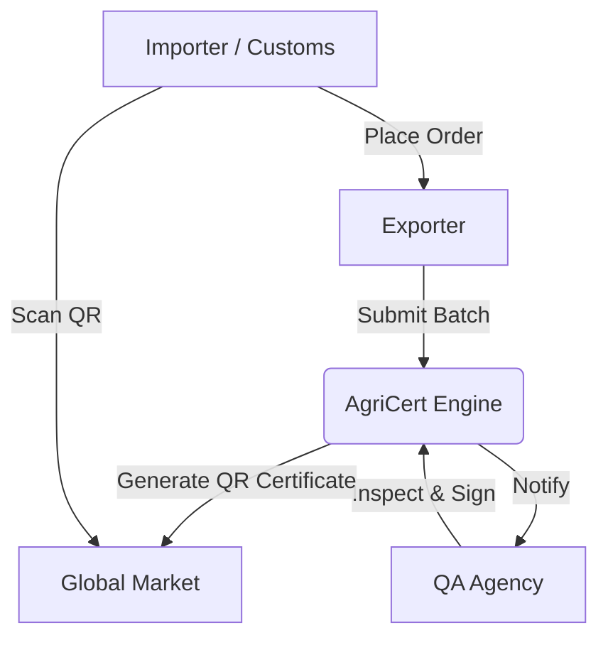

# 🌾 AgriCert: The Digital Proof of Purity 🛡️

### **Revolutionizing Agricultural Quality Certification with Cryptographic Trust**

---

#### [🌐 Live Demo](https://agri-q-cert.vercel.app/) • [📖 Documentation](#-user-workflows) • [🚀 API Docs](#-api-endpoints)

## 🎯 The Global Challenge

Traditional agricultural certification is broken. Paper-based systems lead to massive delays, rampant fraud, and billions in lost trade value.

| 📉 The Old Way | ✨ The AgriCert Way |
| :--- | :--- |
| ❌ **7-10 Day** certification delays | ✅ **24-48 Hour** rapid processing |
| ❌ **15-20%** rejection rate at customs | ✅ **99%** first-pass accuracy |
| ❌ **Easy to forge** paper certificates | ✅ **Cryptographically signed** & tamper-proof |
| ❌ **Slow manual** verification | ✅ **Instant QR-code** authentication |

---

## 🚀 Core Innovation: The Trusted Triad

AgriCert seamlessly connects three critical pillars of the global agricultural trade ecosystem through a unified, secure digital pipeline.

### 👷 For Exporters: *Streamline & Scale*
- **One-Click Submission**: Digital-first batch creation in under 2 minutes.
- **Real-Time Visibility**: Track every step from inspection to certification.
- **Global Reach**: Instant access to international purchase orders.

### 🔬 For QA Agencies: *Precision & Integrity*
- **Standardized Inspections**: Integrated workflows for moisture, pesticide, and ISO compliance.
- **Digital Branding**: Issue cryptographically signed certificates with automated QR generation.
- **Audit Immunity**: Immutable action logs for every certification decision.

### 🚢 For Importers & Customs: *Trust & Speed*
- **3-Second Verification**: Scan any QR code to instantly verify authenticity.
- **Direct Procurement**: Built-in order management for certified batches.
- **Zero Ambiguity**: Full traceability from farm to port.

---

## 🛠️ The Power Under the Hood

Built for speed, security, and global scale using a production-hardened modern stack.

| Tech | Role | Advantage |
| :--- | :--- | :--- |
| **Frontend** | React 19 + Vite | Awwwards-level UI performance & responsiveness. |
| **Backend** | Node.js + Express | Highly scalable async architecture. |
| **Database** | MongoDB Atlas | Flexible, lightning-fast document storage. |
| **Security** | JWT + Bcrypt | Enterprise-grade authentication & hashing. |
| **Crypto** | CryptoJS + QR Codes | Tamper-proof digital passports for every product. |

---

## 📊 System Architecture

---

## 📜 User Workflows

<b>📤 Exporter Workflow</b>

1. **Register**: Sign up as an Exporter.
2. **Submit**: Create a new agricultural batch with documentation.
3. **Track**: Monitor "In Review" status in real-time.
4. **Export**: Download the certified QR certificate and fulfill orders.

<b>⚖️ QA Agency Workflow</b>

1. **Dashboard**: View the live inspection queue.
2. **Review**: Analyze product parameters (Moisture, Pesticides, etc.).
3. **Certify**: Apply cryptographic signature to approve the batch.
4. **Audit**: Review historical issuance analytics.

<b>🔍 Importer & Customs Workflow</b>

1. **Verify**: Scan QR code on physical product or digital certificate.
2. **Browse**: Discover premium, certified batches ready for export.
3. **Order**: Direct PO placement through the platform.
4. **Track**: Monitor shipment status from port-to-port.

---

## 🔌 API Endpoints (v1)

### `POST /api/auth/register`
Create a new role-based account.

### `GET /api/batches`
Fetch authorized batches for the current user session.

### `PUT /api/inspections/:id`
Finalize quality assessment results (QA Role only).

---

## 🚀 Future Roadmap

- 🛡️ **Blockchain Integration**: Migrating audit trails to a permissioned ledger.
- 📱 **Mobile App**: Native Field Inspection app for offline QA.
- 🤖 **AI Prediction**: Predicting shelf-life based on moisture/nitrogen levels.
- 🌍 **Carbon Tracking**: Native ESG metrics for every certified shipment.

---

**Built with ❤️ for Global Food Security**  
© 2026 AgriCert Platform | [Issue Tracker](https://github.com/Rachit-Kakkad1/agricert-platform/issues) | [Support](mailto:support@agricert.tech)

